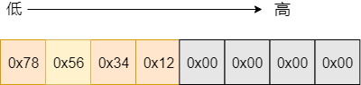

# 理解机器大小端

本文记录一下对机器大小端的测试，并借此机会熟悉一下Go中指针的使用。代码如下:

## 0x01 字节序

```Go
package main

import (
	"fmt"
	"unsafe"
)

func main() {
	a := 0x12345678
	size := unsafe.Sizeof(a)
	fmt.Printf("Type of a: %T\n", a)
	fmt.Printf("size of a: %d\n", size)

	var p = uintptr(unsafe.Pointer(&a))
	var p1 *byte
	for i := 0; i < int(size); i++ {
		p1 = (*byte)(unsafe.Pointer(p))
		fmt.Printf("%p: 0x%x\n", p1, *p1)
		p = p + uintptr(1)
	}
}

```

运行程序，结果如下:
```
Type of a: int
size of a: 8
0xc000076f08: 0x78
0xc000076f09: 0x56
0xc000076f0a: 0x34
0xc000076f0b: 0x12
0xc000076f0c: 0x00
0xc000076f0d: 0x00
0xc000076f0e: 0x00
0xc000076f0f: 0x00

```

可见`int`类型的`a = 0x12345678`在内存中的布局如下图所示:





我的机器是`x86`架构，`x86`采用小端字节序。这样我们就知道了，小端序的机器，对于多字节数据类型，最重要的位(Most Significant Bit)存于高内存地址，最不重要的(Least Significant Bit)存于低地址内存。

## 0x01 unsafe.Pointer

> 注意，`unsafe.Pointer`的4个规则如下：

- 任何指针都可以转换为unsafe.Pointer
- unsafe.Pointer可以转换为任何指针
- uintptr可以转换为unsafe.Pointer
- unsafe.Pointer可以转换为uintptr

## 0x02 参考文章
ßß
[谈一谈字节序的问题](https://mp.weixin.qq.com/s/P7GZ7HaxzNxuAsihfOpKUA)

[Go语言实战笔记（二十七）| Go unsafe Pointer](https://www.flysnow.org/2017/07/06/go-in-action-unsafe-pointer.html)