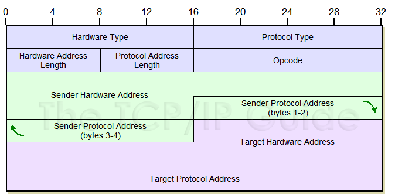

## ARP协议

### 动机
`ARP`是在知道`IP`地址的情况下，在同一个`子网(subnet)`中查找`MAC`地址的协议。

在分层模型中，可以将其视为处于`链路层`和`网络层`之间。

### How
主机或路由，在想知道某个`ip`地址的`MAC`地址的时候，会在`子网中广播广播`发送类似于下面这样的包：

```bash
谁是192.168.0.100？
```
这样的包. 子网中的设备收到广播包之后，发现询问ip是与自己想通，便回复类似下面这样的包：
```
我是192.168.0.100.我的MAC地址是bc:46:99:26:98:c4
```

**注意：回复是单播**。


### 格式
`ARP`协议的格式如下:



用`wiresharks`抓了一个包:


可以看出来，在`ARP`外层是以太网header, dst MAC和src MAC在`ARP`包中已经出现过了。

所以在wire上传送的包是这样的:

```
+--------------+--------------+
+ 以太网Header  |   ARP包      +
+--------------+--------------+
```