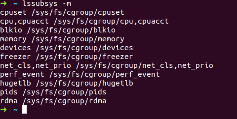
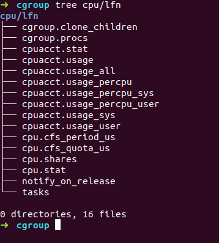

## 初探cgroup

在容器时代，适当了解一点cgroup的知识是必要的。

linux中的cgroup是容器级别虚拟化的关键技术，在物理层面实现对进程使用主机资源的限制。

关于这个概念，可以先阅读下面几篇文章:
- [Docker 背后的内核知识——cgroups 资源限制](https://www.infoq.cn/article/docker-kernel-knowledge-cgroups-resource-isolation/)
- [CGroup 介绍、应用实例及原理描述](https://www.ibm.com/developerworks/cn/linux/1506_cgroup/index.html)
- [DOCKER基础技术：LINUX CGROUP](https://coolshell.cn/articles/17049.html)

### 术语

在CGROUP中存在以下四个基本概念:

- `task（任务）`

    cgroups 的术语中，task 就表示系统的一个进程。
- `cgroup（控制组）`

    cgroups 中的资源控制都以 cgroup 为单位实现。cgroup 表示按某种资源控制标准划分而成的任务组，包含一个或多个子系统。一个任务可以加入某个 cgroup，也可以从某个 cgroup 迁移到另外一个 cgroup。
- `subsystem（子系统）`

    cgroups 中的 subsystem 就是一个资源调度控制器（Resource Controller）。比如 CPU 子系统可以控制 CPU 时间分配，内存子系统可以限制 cgroup 内存使用量。
- `hierarchy（层级树）`

    hierarchy 由一系列 cgroup 以一个树状结构排列而成，每个 hierarchy 通过绑定对应的 subsystem 进行资源调度。hierarchy 中的 cgroup 节点可以包含零或多个子节点，子节点继承父节点的属性。整个系统可以有多个 hierarchy

### 组织结构与基本规则

cgroup的设计中，存在以下四条规则:
1. 同一个 hierarchy 可以附加一个或多个 subsystem。
2. 一个 subsystem 可以附加到多个 hierarchy，当且仅当这些 hierarchy 只有这唯一一个 subsystem.

    也即是说，一个已经attach到某个`hierarchy`中的`cgroup`,如果想同时attach到另一个`hierarchy`上，除非第二个`hierarchy`上没有attach的`cgroup`,否则会失败。
3. 一个 task 不能属于同一个 hierarchy 的不同 cgroup.
    
    系统每次新建一个`hierarchy`时，该系统上的所有 task 默认属于这个新建的 hierarchy 的初始化 cgroup，这个 cgroup 也称为 root cgroup.

    对于你创建的每个 hierarchy，task 只能存在于其中一个 cgroup 中，即一个 task 不能存在于同一个 hierarchy 的不同 cgroup 中，但是一个 task 可以存在在不同 hierarchy 中的多个 cgroup 中。
4. 刚 fork 出的子进程在初始状态与其父进程处于同一个 cgroup

详见上文提到的[Docker 背后的内核知识——cgroups 资源限制](https://www.infoq.cn/article/docker-kernel-knowledge-cgroups-resource-isolation/)中相关内容。

### 看一下自己的系统
内核提供的cgroup功能，以`cgroup文件系统`的形式暴露给用户。因此，我们对cgroup的操控手段，除了熟悉的文件操作之外，没有其他的额外的系统调用。

ubuntu发行版中，我们看到的cgroup系统的默认存在形式如下:
- 在`/sys/fs/`目录下创建`cgroup`目录(目录名叫cgroup是为了方便识别，其实叫别的名字也可以);
- 在`cgroup`目录下，为每一个`subsystem`创建一个同名的目录.比如为cpu子系统创建cpu目录。

    这里创建的每一个目录，都代表一个`hierarchy`,也是这个`hierarchy`下的顶级`cgroup`.
    > 这里需要注意，我们看到的这些目录是`hierarchy`或者叫顶级`cgroup`,而不是`subsystem`. **注意区分！注意区分！注意区分！**

- 在每个目录下，挂载同名的`subsystem`.

    看一下我机器(ubuntu 18.04)

    

    可见，所有的`subsystem`会被挂载到不同的`hierarchy`下，遵循了cgroup的最佳实践。
- 所有的`subsystem`都是以`cgroup文件系统类型`挂载到对应目录中的。这正是暴露给用户，以文件系统操作的形式操纵`subsystem`与`cgroup`之间的关系。

- 如果想在某个已存在的`cgroup`下创建新的子`cgroup`，在对应的目录下创建子目录即可。比如我在cpu这个顶级`cgroup`下新建文件夹`lfn`,便创建了一个新的名为`lfn`的子`cgroup`,系统自动在其下创建了以下文件。

    

    如果我想限制某个进程只能使用`10%`的cpu,那么我可以这样做:

    ```bash
    echo 10000 > cpu.cfs_quot_us
    echo $PID > tasks #$PID是我想要限制的进程的pid
    ```
    写入之后，对该进程使用cpu的限制会立即生效。

## 小结
暂时就写这么点，以后用到了再深入研究吧。事实上如果不做内核相关工作，这点理解也差不都够了。

