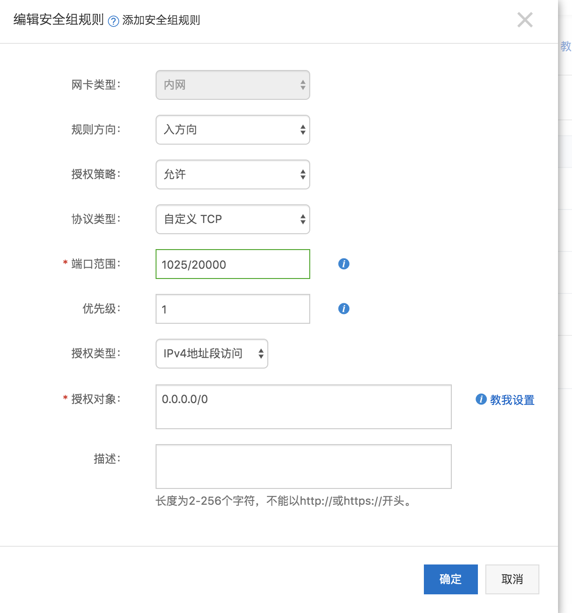

## 反向端口转发
反向端口转发是内网穿透的一种方式。

由于大多数主机处于内网中，没有可在internet上通信的ip,所以我们是无法直接在internet访问这些主机，比如你家里的电脑或者你公司或者你实验室的电脑。

既然如此，我们可以想办法，让内网的主机与具有公网IP的主机建立TCP连接，在公网主机上开启端口转发，作为反向代理，将我们的流量转发到内网主机上。这样不就可以了么？

没错。而且已经有现成的工具可以实现这个需求，那就是:`ssh`.
下面介绍一下具体步骤:

- `step 1: 申请VPS`

    首先，根据上面👆的描述，你需要一台具有公网IP的主机。如果没有，可以去阿里云申请，学生党的话一台不错的主机每个月也就10块钱。

- `step 2: 安全组中开放端口`

    针对ECS实例，配置安全组，开启特定端口。比如你可以开启从1025-2000的端口(这是指示例，实际上应该开尽可能少的端口-最少必须原则)

    


- `step 3: 更改sshd配置`

    编辑`/etc/ssh/sshd_config`, 设置`Gateway`的值为 `yes`.

    ```bash
    GatewayPorts yes
    ```
    这一步需要重点强调一下，如果不在VPS上打开这个开关，那么用下一步中的命令, ssh的转发端口只会对`localhost`开放。我因为排查这个小问题，浪费了好几个小时。

- `step 4: 内网连接VPS,启动端口转发`

    在内网机器上执行下列命令即可。

    ```bash
    ssh -fNR REMOTE_PORT:localhost:LOCAL_PORT USER@REMOTE_IP
    ```

    解释一下这行命令:
    - `-f`: 为了不希望在端口转发时有一个总是保持打开状态的shell
    - `-R`: 反向端口转发。也就是开启的是VPS的端口转发
    - `-N`: 不要远程执行命令，配合`-R`用
    - `REMOTE_PORT`: 公网暴露的端口，你将从VPS的这个端口访问到你内网的服务。注意，这种写法这里等价于`0.0.0.0:REMOTE_PORT`.回看`step 3`,我们必须让`GatewayPorts = yes`，这里的`0.0.0.0`才其作用。
    - `LOCAL_PORT`: 本地服务暴露的端口。比如你的服务是一个python起的静态文件服务器:

        ```bash
        python3 -m http.server
        ```
        那么`LOCAL_PORT`便为`8000`.
    - `USER@REMOTE_IP`: 你的VPS用户名和IP.
    

- `step 5:确认端口转发已生效`

    访问`REMOTE_IP:REMOTE_PORT`,看到的应该就是你内网中暴露在`LOCAL_PORT`中的服务。比如`python -m http.server`的话，就能看到内网主机启动这行命令所在目录中的内容了。

    


    
